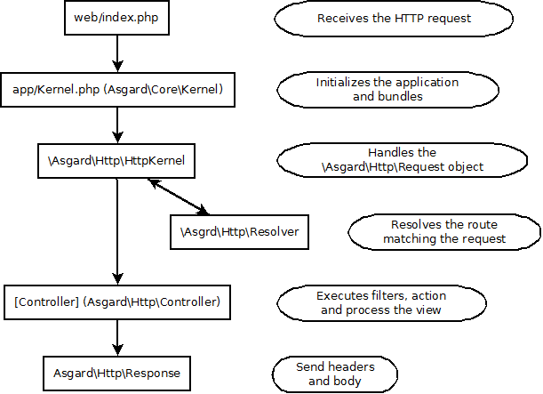

#Request & Response

- [Request lifecycle](#lifecycle)
- [Request object](#object)
- [Response object](#response)

##Request lifecycle

In a typical asgard project, the request first lands on the web/index.php file.

This file instantiates app/Kernel (which extends \Agard\Core\Kernel) and asks him to load the application. The Kernel sets the environment name, creates a new services container, loads the configuration files and initializes the bundles.

Bundles then provides their services to the container and execute their own initialization code in a second time.

The handle is them passed to the HttpKernel object which creates the request object from the globals ($_GET, $_POST, etc.) and ask the resolver to return the controller matching the request. HttpKernel then passes the request object to the controller.

The controller initialize the filters and execute the "before" methods. The action then follows and a view is built from the action. Finally if there is any, the controller executes the "after" methods of the filters, after which a response object is returned all the way to the index.php file.

The response object is then sent to the client. It will send the HTTP headers and print its body.

##Request object

###Create a request from global variables:

	$request = \Asgard\Http\Request::createFromGlobals();

This will use global variables such as $_POST, $_GET, $_COOKIE, etc. to create the object.

###Accessing inputs

You can access all the request variables like:

	$request->url; #URL
	$request->get; #$_GET
	$request->post; #$_POST
	$request->file; #$_FILEs
	$request->server; #$_SERVER
	$request->cookie; #$_COOKIE
	$request->header; #getallheaders()
	$request->body; #php://input

For all these variables except url and body, you can access their content like:

	$request->get['id']
	#or
	$request->get->get('id')

For nested arrays of parameters you can chain them like:

	$request->post['element']['id'];
	#or
	$request->post->get('element.id'); #returns null if it does not exist

To check for an variable existence, use isset or has:

	$request->get->has('id') #returns true|false
	#or
	isset($request->get['id']);

To set cookies, use:

	$request->cookies['id'] = 3; #domain=/ and time=infinite
	#or
	$request->cookies->set('id', 3, $domain, $time);

To unset a cookie variable:

	unset($request->cookies['id']);
	#or
	$request->cookies->delete('id');

###URL Object

You access the url through the request:

	$URL = $request->url;

####Get the relative url

	$url->get(); #admin/posts/1/edit

####Get the absolute url

	$url->current(); #http://www.example.com/admin/posts/1/edit

####Get the full url with GET parameters

	$url->full(); #http://www.example.com/admin/posts/1/edit?a=b&c=d

####Get the full url plus your own GET parameters

	$url->full(['a'=>123]); #http://www.example.com/admin/posts/1/edit?a=123&c=d

####Get the absolute url to a specific location:

	$url->to('home'); #http://www.example.com/home

####Get the host

	$url->host(); #http://www.example.com

####Get the root folder

	$url->root(); #mywebsite (if your application is located in www.example.com/mywebsite/)

##Response object

###Get the response content

	$response->getContent();

###Get the response HTTP code

	$response->getCode();

###Get the response headers:

	$response->getHeaders();

###Send headers and content:

	$response->send();